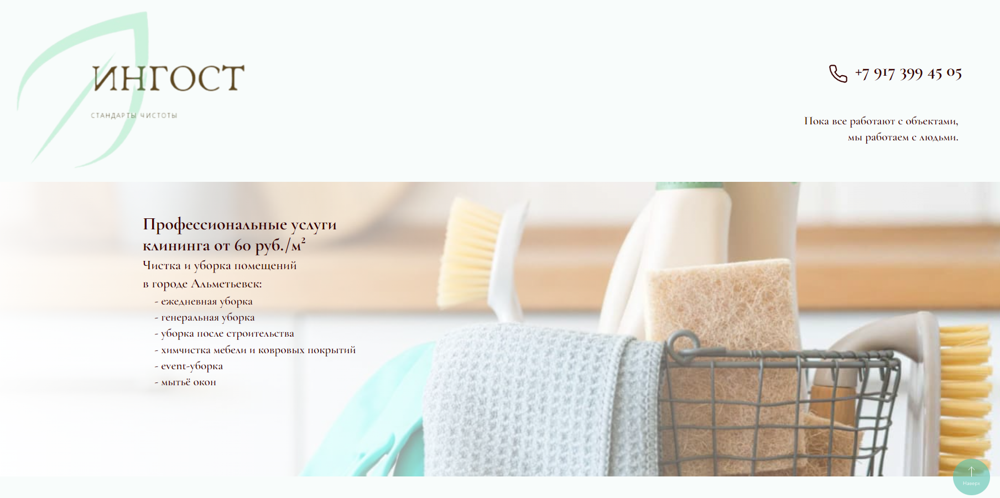
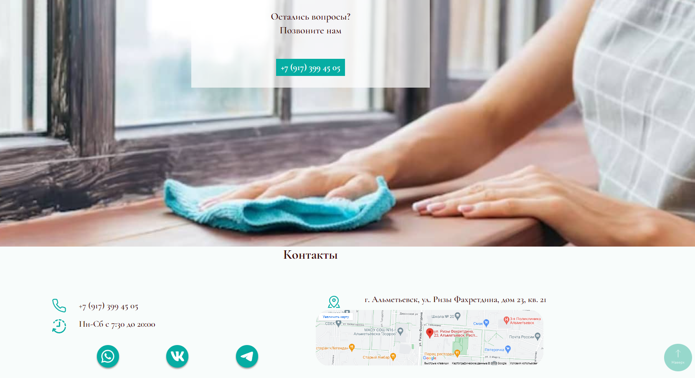

# Ingost - professional cleaning service

Responsive website for a cleaning service company

## Getting started

Host the parent directory on the webserver

## Technologies:

  &nbsp;
  &nbsp;
  
  

## Thanks to all Contributors

## Result
https://almetevsk-uborka.ru  
https://yanakin394.github.io/Ingost_Project/  
